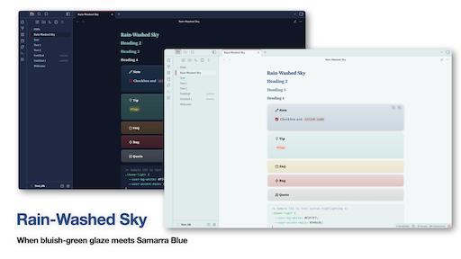

# Rain-Washed Sky - Obsidian Theme

> "The rain passes, the clouds break, and the sky is the color of the day."  
> (雨過天青雲破處，這般顏色做將來)

**Rain Washed Sky** is an Obsidian theme inspired by the timeless aesthetics of Chinese porcelain. It balances the delicate, jade-like texture of **Ru Kiln (Ru ware)** with the deep, vivid contrast of **Blue and White porcelain**.

---

## ✍️ Formatting Features

This theme includes specific styling tweaks to enhance writing and presenting.

### 📎 Smart Embeds (Transclusions)

By default, embedded notes (`![[Note]]`) hide the file name for a seamless reading flow. You can force the title to appear by adding a header alias:

- `![[Note Name|h1]]` → Displays title as a large H1.
- `![[Note Name|h2]]` → Displays title as a medium H2.

### 🖥️ Presentation Mode (Slides)

Optimized for the core **Slides** plugin:

- **Scrollable Slides:** Long content automatically scrolls instead of being cut off.
- **Alignment:** Text is left-aligned for better readability.
- **Scaling:** Global slide size can be adjusted via the `--slide-base-size` variable in the CSS.

### 🧱 Tactile Elements

- **3D Callouts:** Blockquotes and Callouts have a "floating" porcelain texture with rounded corners and soft shadows.
- **Mermaid Diagrams:** Constrained to page width by default; **hover** over a diagram to zoom in and scroll.
- **Typography:** Uses **Source Serif 4** and **Noto Serif TC** with increased line height (1.8) for a book-like experience.

---

## 🏗️ Installation

1.  Open Obsidian **Settings** > **Appearance** > **Themes**.
2.  Click **Manage**, search for **"Rain Washed Sky"**, and install.
